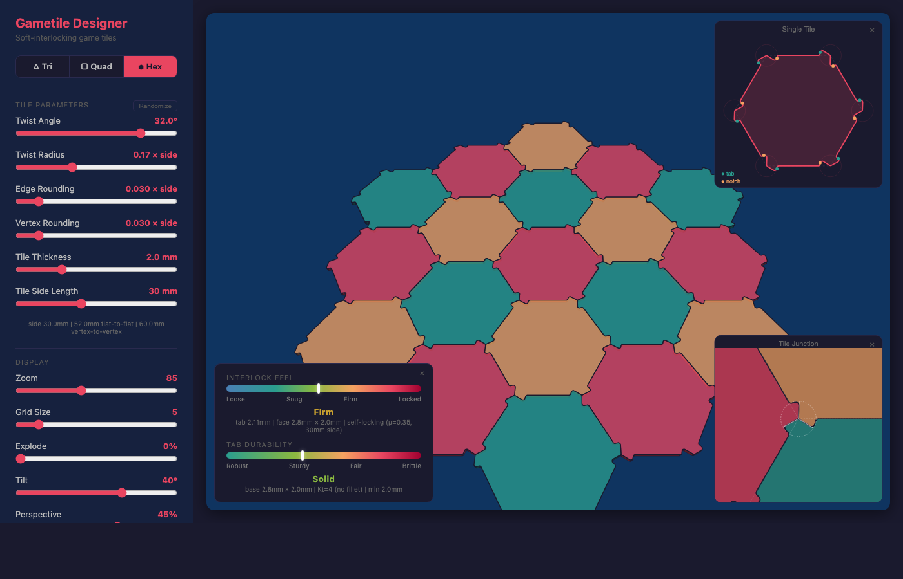

# Gametile Designer

Interactive design tool for laser-cut board game tiles (triangle, square, hexagon) that softly interlock via a twist mechanism at tile vertex junctions.

**[Try it live](https://heathdutton.github.io/gametile-designer/)**

## Features

- **Three tile shapes** — triangle, square, and hexagon via pill switch
- **Twist-lock joints** — adjustable twist angle, radius, edge rounding, and vertex rounding
- **Angular or arc-based** joint geometry
- **Physics gauges** — interlock feel and tab durability with real-world estimates
- **3D preview** — tilt and perspective projection with extruded side walls
- **SVG export** — single tile or full grid, production-ready for laser cutting
- **Tile dimensions** — side length 10–60mm, thickness 0.5–6mm
- **6 color themes** — Neon, Berry, Earth, Ocean, Slate, Synth
- **Randomize** — one-click random tile parameters and shape
- **URL state sharing** — every parameter persisted in the URL hash
- **Categorized examples** — presets for each shape type
